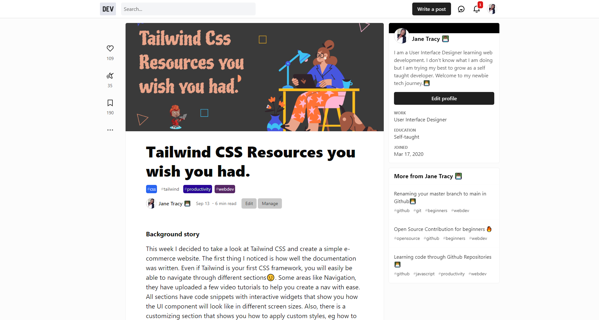

# 100 Days Of Code - [Dev blog artices](https://dev.to/janetracydev)

#### My social media platform

[Twitter](https://twitter.com/TracyCss "Follow me on Twitter")  
[CodePen](https://codepen.io/tracey_jane "Follow me on CodePen or check out my pens")  
[GitHub](https://github.com/muchirijane "Follow me om GitHub or check out my projects")  
[Dev Community Blog](https://dev.to/janetracydev "Follow me and  check out my posts")

## Welcome to my journey!

[100daysofcode.com](https://100daysofcode.com) &bull; [#100DaysOfCode](https://twitter.com/hashtag/100DaysOfCode) &bull; [@ka11away](https://twitter.com/ka11away)

### My Goals

At the end of this challenge i would love to have learnt the following:

- Gsap Animation
- Object Oriented Programming in JS
- Create more front-end websites
- Learn Vue/react js
- Node Js
- Improve in refactoring code and degugging

This are the sections I am going to focus on to improve my front end skills. I hope during or by the end of the challange I will have a job in front end development or freelancing.

### Contents

- [Rules](rules.md)
- [FAQ](FAQ.md)
- [Resources](resources.md)

---

### Day 1:

##### Create a blog post about Git and Github for beginners

**Today's Progress**: I have always wanted to understand the basic git commands. This made me do more reading about it and make notes on it

**Task Accomplished:** After going through different documents on the internet, watching videos on Youtube i finally got the git and github basics.
Since i have nver created a tech post,I created one on this topic.

**Link to work:** [Git and Github for beginners on dev blog](https://dev.to/tracycss/git-and-github-for-beginners-po3)

**Tweet:** https://twitter.com/TracyCss/status/1274346856387141636

---

### Day 2

##### Pull request and my first contribution

**Today's Progress**: I always wanted to know how to do pull request and contribute to projects on Github.

**Task Accomplished:** I went ahead to do my research on youtube and I was able to do my first simple contribution to the Github community.

**Results:** In the blog I created I made a bonus section on how to do a pull request and a quick guide to open source contribution.

**Tweet:** https://twitter.com/TracyCss/status/1275057548131856384

**Link to my blog:**

- [Blog post](https://dev.to/tracycss/git-and-github-for-beginners-po3)

---

### Day 3

##### Learning boostarp 5 alpha 1

**Today's Progress**: I decided to learn about boostrap 5 and it's components.

**Task Accomplished:** I was able to create different components like navbar forms and the new grid system.

**Results:** I created a simple website which I also designed it with Balsamiq desktop app.

**Tweet:** https://twitter.com/TracyCss/status/1275057548131856384

**Link to my blog:**

- [Githut repository](https://github.com/muchirijane/boostrap-5-website)

---

### Day 4

##### Getting started with Gsap animation

**Today's Progress**: I started going through the Gsap documentation to know how to use it in both logos and images

**Task Accomplished:** I was able to learn how to use animations in images and create different timing durations.

**Results:** I started coding an amazing websited designed by [Shamima Nasrin](https://dribbble.com/shamimanasrin?ref=uistore.design). I used Gsap to create the amazing animations

**Tweet:** https://twitter.com/TracyCss/status/1276560015395094529

---

### Day 5

##### Getting started with Gsap animation

**Today's Progress**: I continued going through the Gsap documentation to know how to use to make stagger animation.

**Task Accomplished:** I was able to learn how to use rotation animation in images and create different timing durations.

**Results:** I continued coding the amazing websited designed by [Shamima Nasrin](https://dribbble.com/shamimanasrin?ref=uistore.design).
I used Gsap to create the amazing animations

**Tweet:** https://twitter.com/TracyCss/status/1276560015395094529

---

### Day 6

##### Getting started with Gsap animation

**Today's Progress**: I continued going through the Gsap documentation to know how to use to make stagger animation.

**Task Accomplished:** I was able to learn how to use rotation and scale animation in images and create different timing durations.

**Results:** I continued coding the amazing websited designed by [Shamima Nasrin](https://dribbble.com/shamimanasrin?ref=uistore.design).
I used Gsap to create the amazing animations

**Tweet:** https://twitter.com/TracyCss/status/1277547377658933253

---

### Day 7

##### Getting started with Gsap animation

**Today's Progress**: I continued going through the Gsap documentation to know how to use to make stagger animation.

**Task Accomplished:** I was able to learn how to use scale and position animation(x and y) in images and create different timing durations.

**Results:** I continued coding the amazing websited designed by [Shamima Nasrin](https://dribbble.com/shamimanasrin?ref=uistore.design).
I used Gsap to create the amazing animations

**Tweet:** https://twitter.com/TracyCss/status/1277873031004684288

---

### Day 8

##### Getting started with Regex in javascript

**Today's Progress**: I started learning about regex syntax and how to work with it to validate forms.

**Task Accomplished:** I was able to understand regex syntax and how it operates in JavaScript. Getting to know about single characters, the greedy characters and the quantifiers.

**Results:** I was able to create a simple login in form that has validation with the help of regex characters.

**Tweet:** https://twitter.com/TracyCss/status/1278316219968479232

[💻 Github source files](https://github.com/muchirijane/regex-basic)  
[🎥 Live preview](https://muchirijane.github.io/regex-basic/)

**Update:** My Git and Github for beginners post got in the top 7 post in Dev community and also got the Git badge. Totally amazing for my first tech blog article to get this far.

---

### Day 9 - 10

##### Regex expression in javascript

**Today's Progress**: I continued learning about regex syntax and how to work with it in code editors or strings in inputs.

**Task Accomplished:** I was able to get to know how to a string and group it into individual groups with regex pattern.

**Results:** I was able to code a fun project where text value from the textarea is converted into span tags that you can hover over and they change their background color.

**Tweet:** https://twitter.com/TracyCss/status/1278964521613303808

[📜 Github source files](https://github.com/muchirijane/regex-word-generator)  
[🎥 Live Preview ](https://muchirijane.github.io/regex-word-generator/)

---

### Day 11

##### Regex expression in javascript

**Today's Progress**: After learn about regex expression and how it's applied in forms, card validation and other areas.

**Task Accomplished:** Learn more about regex and write an artcle.

**Results:** I was able to publish my second tech post about Regex expression in Javascript for beginners. This is a deep drive of regex,, it's aplication and resources to use to learn it.

**Tweet:** https://twitter.com/TracyCss/status/1279770095225647104

**Dev Post:** [✍ Regex expression in Javascript for beginners](https://dev.to/tracycss/basic-regex-in-javascript-for-beginners-1dnn)

---

### Day 12 - 13

##### Web speech API in javascript

**Today's Progress**: Started learning about speech recognition and speech synthesis.

**Task Accomplished:** I was able to go through Mozilla developer documentation about Web Speech API and build their examples as I learn.

**Results:** I was able to publish my second tech post about Regex expression in Javascript for beginners. This is a deep drive of regex,, it's aplication and resources to use to learn it. I found a git repo from coding curry and I also used it in my learning process.

**Tweet:** https://twitter.com/TracyCss/status/1281474098326114305

[📜 Github source files ](https://github.com/muchirijane/chat-trial)  
[🎥 Live Preview ](https://muchirijane.github.io/chat-trial/)

---

### Day 14 - 16

##### Web speech API in javascript

**Today's Progress**: Continued learning about speech recognition and speech synthesis.

**Task Accomplished:** I was able to build a chatbot with JavaScript.

**Results:** I built a deve assist chatbot which can help code newbies get started with web developement. I named the chatbot Rico. He can get the basic resources such where to learn Javascript or react Js. Also it recommends junior developers on youtube who have documented their journey into the field.

**Tweet:** https://twitter.com/TracyCss/status/1283366013531234305

[Github source files 📜 ](https://github.com/muchirijane/chat-trial)  
[Live Preview 🎥 ](https://muchirijane.github.io/chat-trial/)

---

### Day 17

##### Advanced ES6 features

**Today's Progress**: Learned about rest, spread syntax

**Task Accomplished:** Rest parameter - Helps to put all parameters inside a function in one array.  
Spread syntax (arrays) - turns array components into individual values  
Symbol is a primitive type - Can be used as keys or property names in objects

**Results:** I was able to understand how set, rest and spread are used in a array. Also how to use set and it's properties like .add, .size, .has and .delete .
**Tweet:** https://twitter.com/TracyCss/status/1284146667097382912

---

### Day 18-19

##### Webpack and babel

**Today's Progress**: Learned about how to use webpack and babel

**Task Accomplished:** I learnt how important it is to use babel to convert modern ES6 javascript code to code that older websites can run. Also I got to work with webpack and even use the webpack-dev-server to run a local server for distributed coding files. It was important for me to see how to use both production and development modes in a project.

**Results:** I was able to install babel and webpack packages from scratch and write some digital notes from my lessons. Moving from a simple environment of just html, css and js file to webpack development is new and I will need more practice to be able to run this development smoothly.
**Tweet:** https://twitter.com/TracyCss/status/1284146667097382912

---

### Day 21-22

##### Introduction to promblem solving

**Today's Progress**: Learned about about problem solving and how to approach them step by step.

**Task Accomplished:** Finished watching a few videos about frquency problems and did some quizzes too.

**Results:** I can now use frequency approach to solve problems. I am not fully confident with this approach but with some practice I will be.

**Tweet:** https://twitter.com/TracyCss/status/1289094299913793536

## 

### Day 23

##### Webpack and Babel blog

**Today's Progress**: I was able to read some materials on Webpack and babel to fresh my knowledge. I decided to write something about it, in order to help beginners understand it better and have a boilerplate for a project. I went through net ninja crash course about babel.

**Task Accomplished:** Yeas, I wrote an article and published it to dev.to platform.

**Results:** My webpack and babel [blog post](https://dev.to/tracycss/webpack-and-babel-for-beginners-103l) on dev.to platform.

**Tweet:** https://twitter.com/TracyCss/status/1290319063701499904

✍ [Blog post about babel](https://dev.to/tracycss/webpack-and-babel-for-beginners-103l)

---

### Day 24

##### Introduction to Node

**Today's Progress**: I got started with Node Js as my first JavaScript framework. Went through the introduction section about how to use it and the pros and cons of node. Since I have used Javascript it was the best framwork to chooose instead of another language.

**Task Accomplished:** I was able to understand the synchronous and asynchronous nature of Node Js and how to know when to use it. Got to learn how to use a server and how to create one.

**Results:** Created a simple web server in node js and import https and file system modules.

**Tweet:** https://twitter.com/TracyCss/status/1290683830458777602

---

### Day 25

##### Introduction to multiple pointers in problem solving

**Today's Progress**: I learnt how to use multiple pointers to solve problems in algorithms question. To be honest, It's better to know different approaches and choose the onw you are most comfortable with.

**Tweet:** https://twitter.com/TracyCss/status/1290683830458777602

---

### Day 26

##### Taking problem solving quizzes

**Today's Progress**: I did some quizzes on problem solving and wen't through some notes from yestarday.

**Task Accomplished:** I was able to understand how multiple pointers works in different situations. Also how to use sets in an Array to remove numbers that are repetitive.

**Results:** Got 3 questions out of 5 that I did.

**Tweet:** https://twitter.com/TracyCss/status/1290683830458777602

---

### Day 27

##### Finished the Node farm oroject

**Today's Progress**: Finished up the my first node project today! I got to learn a lot about node js. Just the basic on how to set up a server, use API and how to connect your Json data to the client server.

**Task Accomplished:** Complected the node farm from scratch by watching the node bootcamp course by Jonas.

**Results:** I was able to connect the frontend to the backend data using a simple API aerver with Node Js.

**Tweet:** https://twitter.com/TracyCss/status/1292140857236258828

---

### Day 28-29

##### Quizzes on multiple pointers

**Today's Progress**: Today I repeated the questions I didn't get in the problem solving. It is always good to go back and see where you did wrong and how you can improve. It takes time to fully know algorithms.

**Tweet:** https://twitter.com/TracyCss/status/1293594758246473728

---

### Day 30-31

##### Created Node home chef

**Today's Progress**: I went to figma to create some mockups for the Node home chef website. Then I proceeded to make the prototype just to see how the website would function. Then did the actual coding of the project.

**Task Accomplished:** Used Html, CSS and node Js to make the full website function in the server. I learnt a lot about filling html templates and making simple modules to functions that can be reused across the application.

**Tweet:** https://twitter.com/TracyCss/status/1294357477794996224

---

### Day 32

##### Finished the Node farm oroject

**Today's Progress**: Created an app on how to build a simple Api by using Jona's course and trying to explain each line of code.

**Results:** Make a 9 minute read blog on how I created the node home chef application. I also shared why I was learning node Js as a way to learn Javascript.

Blog ✍ : [How to make a simple API server with Node Js for Beginners](https://dev.to/tracycss/build-an-simple-api-with-node-js-for-beginners-oi)

**Tweet:** https://twitter.com/TracyCss/status/1292140857236258828

---

### Day 33

##### NPM packages and how the internet works

**Today's Progress**

#### How the web Works

The user/client types in the url of a webpage in a browser, the request is sent to the server where the website is hosted then the server sends back the response by getting the webpage content to the client. This is called client-server architecture or Resquest reponse model.

1. First when your enter the domain name it is sent back to DNS Domain Name Server where it gets the real IP address of the website.
   //https://www.google.com/maps to https://216.58.211.206:443. The protocol is http|| https, IP address is 216.58.211.206 and port number is 443 for https || 80 for http.

2. A TCP/IP socket connection is established between the server and the client. TCP is the Transmission Control Protocol and IP is the Internet Protocol, they ddefine how data travels across the web. They set the rules on how data moves across the internet.

3. The Http request is sent to the server. HTTP is Hyper Text Transmission Protocol which is a communication protocol that allows two or more systems to communicate. Http is a protocol that allows the client and server to communicate by sending and receiving messages.
   Types of HTTP methods: (GET/maps HTTP/1.1)

- GET - for requesting data
- post - for sending data
- patch - for modifying data
  The HTTP request has the :
- Start line contains: Http method, request target and http version.
- Http request header has contains Host : www.google.com, User-Agent: Mozilla/5.0 and Accepted language - en-us
- Body response only when it's sending data to the server. (POST)

4. A HTTP response is sen back from the server.
   The http response contains:(HTTP/1.1 200 ok)

- Start line with http version, status code and status message.
- Response message
- response body

5. The TCP breaks the HTTP request and response into small chunks called packets before they are sent, then it assemble them into their original request and response. The IP protocol sends and routes all the packets through the internet. It makes sure the packets goes back to their respetive IP addresses.

(Amazing summary notes from Jonas course)

**Results:** I was able to understand how the internet works behind the scenes.

---

### Day 34

##### NPM packages and how the internet works

**Today's Progress**

#### Static, Dynamic and Api-powered websites

- Static websites have ready files that are served to the browser. Like Html, Css, Jvascript and images files. They display the same content for every user.

- Dynamic website are built on the server each time a new request comes in. It has a database which get the data, with a pre-defined template it builds each page the user requests. From each client based request the page is build with Html, css, images and javascript. This pages are then sent to the browser. This process is also callled server-side rendering. Thus it dynamic beccause the content can change according to the user actions or data in the database. Example is the Twitter website, every time you login you see different tweets.

Web application are dynamic websites with functionality like logging in, signing up or creating profiles.

- API-powered website are websites that have a database that fetches data and its build in two steps:
  a) Building the Api
  b) Consuming the Api
  The Api-powered websites are dynamic websites but the only difference is that Api-powered website send JSON data format to the browser not the entire website. Only the data is sent to the client, no Html,css or js files. When it reaches the browser, it builds the website through the templates created.
  An API is Aplication Programming Interface which is a software that allows application to talk to each other.

(Amazing summary notes from Jonas course)

**Results:** I was able to understand how the internet works behind the scenes.

---

### Day 35

##### Blog post

**Today's Progress**

#### Learning how to code through github repository.

- I created a blog post where I shared github resources that I have found useful over the time I am coding. It's always good to share with the community and help other code newbies out. To be honest I wish I had found these resources earlier in my journey but that's why I wrote it, to help others.

**Results:** ✍ Dev.to blog post [Learning how to code through GitHub repository](https://dev.to/tracycss/learning-code-through-github-repositories-2bp7)

---

### Day 36

##### Open Source Contribution

**Today's Progress**

#### Learning how to use flags and create a pull request.

- I want to start contributing to Open Source projects and be better at my coding skills. It's a good way of to get other developers to review your code plus the feeling you get when your pull request is accepted, it's amazing. I decided to contribute to Protege.dev website. This is a good platform where junior developers can get remote jobs and gain experince through WFH(work from home).

**Results:** ✍ Became a first contributor to [Protoge](https://protege.dev/)

---

### Day 37

##### Github Action

**Today's Progress**

#### Started reading the Github Action documentation

- Earlier in the day, I created another pull request to solve another issue on Dev Protege and It was merged into the main project repository. Yeah, the feel is good. I was able to learn how to create a issue template that includes a bug report and a feature request. I then headed to the Github Action documentation page to learn how to create a javascript action. I have never used CI/CD workflows, all this is totally new to me but I will learn how to use it.

**Results:** ✍ Getting another PR merged and getting to know what Github action is.

---

### Day 38

##### Github Action

**Today's Progress**

#### Continued reading the Github Action documentation

- Step by step I created the hello world github action which is created in javascript. I got to read the [documentation](https://docs.github.com/en/actions/creating-actions/metadata-syntax-for-github-actions#runsstepsenv) and learn about different metadata syntax that should be used when creating an action.

**Results:** 👩‍💻 Greated the Github action Hello World.

[Tweet](https://twitter.com/TracyCss/status/1299070758493261824)

---

### Day 39

##### Github Action

**Today's Progress**

#### Continued reading the Github Action documentation

- Started to create my own action. I want to use json file to connect it to the readme file. I got some tests to pass but some failed. I will still continue to do my research on it and see how I can resolve the failed test. As a first timer doing this, It's not easy at all, but I love the change.

**Results:** 👩‍💻 Started to create my own Github action.

---

### Day 40

##### Blog post

**Today's Progress**

#### Open Source Contribution for Beginners.

- I created a blog post about open source contribution and how I got started. I worte the truth and some might think it was funny or simple but for a beginner it was a big step for me. With the Hackobter coming next month, I thought the post would be useful for beginners out there. I guess I am writing post I wish I had read before to guide me in the beginning of my journey.

**Results:** ✍ Dev.to blog post [Open Source Contribution](https://dev.to/tracycss/learning-code-through-github-repositories-2bp7)

---

### Day 41-42

##### What I am Upto now

**Today's Progress**

#### Learning React Js.

- I started learning React Js for a project I want to be involved with. The team is amazing and I would love to be part of that community which welcomes beginners and allow them to grow. I will be contracting om React Js for the next 2-3 months fully. Long days and long nights ahead of me but the results will be amazing. I have started to use FreeCodeCamp to get started with React Js basics. I can now see the difference btw Html and JSX and how to create class names with CamelCase format. I can't wait to learn more.

**Results:** ✍ Learnt how to create JSX syntax and to create react components.

---

### Day 43

##### Dev blog post

**Today's Progress**

#### Renaming master branch to main branch.

- From 1ST October 2020, Github will make the main branch the default branch which is amazing. The funny thing is, I just learned about it last week. I decided to make a blog post to let others know how to change it. It's always good to share information as you learn that's how I understand things better through research and writing.

**Results:** ✍ Posted another blog post on Dev.to [Renaming master to main branch](https://dev.to/tracycss/renaming-your-master-branch-to-main-in-github-24cm)

**Tweet** The post was also retweet by [Dev.to](https://twitter.com/ThePracticalDev/status/1303091174245269509)

---

### Day 44

##### Desigining in Figma

**Today's Progress**

#### Designing beats studio3.

- I have always been using Photoshop or Adobe XD for design but when I started learning how to code during the lockdown, I shifted to Figma. Most because of the code snipped thay have. It makes it easier to code faster when you can see the height and width of your component in each frame. I used the bests by Dre offical website to get an inspiration to create another version of it but for only the skyline collection. I have always loved the quality of these headphones used them once when watching a movie and I immediately fell in love with them. Hope I will have enough money to buy one or two someday.

**Results:** ✍ Created the skyline collection website for beats by Dre and made different frames from desktop to mobile. It always good to make website responsive.

---

### Day 45-46

##### Coding in Figma

**Today's Progress**

#### Building beats studio3.

- The past three days have been helpful. I was able to starting a real small website project that I designed in Figma. I wanted to go through the whole process of sketching, responsive design in figma to coding the website. I used Tailwind CSS a Css framework to learn and practice. The only way to I understand is by doing and seeing everything detail completed to the end. I used some custom css style like the colors, insets, rems, font family and font sizes to ensure the coded website looked like the design (Talkimg about making things pixel perfect. hahaha). I never used min-width in my coding, so it took a minute before I got used to it. But I can say I love Tailind Css and I will be using it more in my projects.

**Results:** ✍ Coded a responsive website with Tailwind Css called [Beats studio3](https://github.com/muchirijane/Beats-studio3) by Beats by Dre. 

<!--  -->

---

### Day 47

##### Dev to blog post

**Today's Progress**

#### Tailwind css resources.

- After building the beats by dre website I decided to write an articles about tool or resources I found useful in my journey. As they say, sharing. 

**Results:** ✍ [Tailwind Css resources you wish you had]().

---